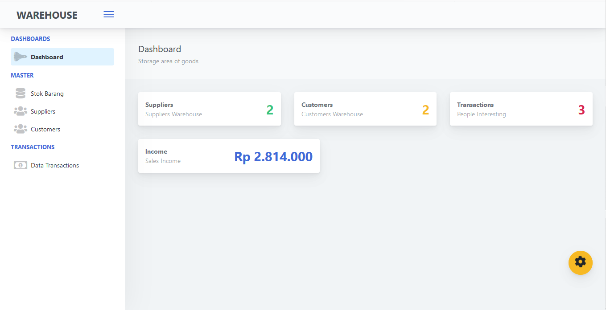

# Sistem-Informasi-Penyediaan-Barang
Tugas UAS Web Dasar

Cara Konfigurasi ( Rekomendasi menggunakan XAMPP )
- Letakan File pada htdocs
- Buat Database Pada MySqli dengan nama umt_warehouse
- Import umt_warhouse.sql pada database yang sebelumnya dibuat
- Buka file Project pada Code Editor VScode/Sublime atau lainnya
- Buka App -> Config -> Config.app
- Set BASEURL dengan nama penempatan file project dihtdocs
- Set DB sesuai akun XAMPP yang dimiliki
